# 🚀 Dewata Motor Deployment Scripts

Kumpulan script untuk deployment dan maintenance aplikasi Dewata Motor di server Ubuntu.

## 📁 File Structure

```
deployment-scripts/
├── README.md                # Dokumentasi ini
├── deploy.py               # Script deployment utama (lengkap)
├── deploy-quick.sh         # Script deployment cepat
├── update-app.py          # Script update aplikasi
├── health-check.py        # Script monitoring kesehatan
└── DEPLOYMENT.md          # Dokumentasi deployment lengkap
```

## 🎯 Quick Start

### 1. One-Click Deployment

Untuk deploy baru di server Ubuntu kosong:

```bash
# Download dan jalankan script quick deployment
curl -sSL https://raw.githubusercontent.com/weida9/DewataMotorRent/main/deployment-scripts/deploy-quick.sh | sudo bash
```

### 2. Manual Deployment

```bash
# Download script deployment
wget https://raw.githubusercontent.com/weida9/DewataMotorRent/main/deployment-scripts/deploy.py

# Jalankan deployment
sudo python3 deploy.py
```

### 3. Update Aplikasi

Untuk update aplikasi yang sudah terinstall:

```bash
# Download script update
wget https://raw.githubusercontent.com/weida9/DewataMotorRent/main/deployment-scripts/update-app.py

# Update dengan backup
sudo python3 update-app.py --backup

# Update tanpa backup (tidak disarankan)
sudo python3 update-app.py
```

### 4. Health Check

Untuk monitoring kesehatan aplikasi:

```bash
# Download script health check
wget https://raw.githubusercontent.com/weida9/DewataMotorRent/main/deployment-scripts/health-check.py

# Jalankan health check
sudo python3 health-check.py

# Health check dengan email alert
sudo python3 health-check.py --email admin@example.com

# Health check quiet mode
sudo python3 health-check.py --quiet
```

## 📋 Script Details

### 🔧 deploy.py
**Script deployment lengkap untuk server Ubuntu kosong**

**Fitur:**
- Install semua dependencies (Apache, MySQL, PHP, Python)
- Setup database dan user
- Install phpMyAdmin
- Configure firewall (UFW)
- Setup SSL dengan Certbot
- Create systemd services
- Setup backup otomatis
- Security hardening

**Yang diinstall:**
- Apache2 + mod_wsgi
- MySQL Server 8.0+
- phpMyAdmin
- Python 3.8+ + pip + venv
- UFW Firewall + Fail2ban
- Certbot (Let's Encrypt)
- Git, curl, wget, htop

**Usage:**
```bash
sudo python3 deploy.py
```

### ⚡ deploy-quick.sh
**Script deployment cepat (bash wrapper)**

**Fitur:**
- Download dan jalankan deploy.py otomatis
- Check root permissions
- Install Python3 jika belum ada

**Usage:**
```bash
sudo bash deploy-quick.sh
# atau
curl -sSL https://raw.githubusercontent.com/weida9/DewataMotorRent/main/deployment-scripts/deploy-quick.sh | sudo bash
```

### 🔄 update-app.py
**Script update aplikasi dari GitHub**

**Fitur:**
- Backup otomatis sebelum update
- Pull latest changes dari GitHub
- Update Python dependencies
- Apply database migrations
- Rollback jika gagal
- Verify update success

**Usage:**
```bash
# Update dengan backup (recommended)
sudo python3 update-app.py --backup

# Update tanpa backup
sudo python3 update-app.py

# Rollback ke backup tertentu
sudo python3 update-app.py --rollback /var/backups/dewata-motor/updates/backup_20250101_120000
```

### 🏥 health-check.py
**Script monitoring kesehatan aplikasi**

**Fitur:**
- Check status services (Apache, MySQL, App)
- Test web application response
- Check database connectivity
- Monitor disk space & memory usage
- Check recent error logs
- SSL certificate monitoring
- Email alerts (opsional)

**Usage:**
```bash
# Basic health check
python3 health-check.py

# Dengan email alerts
python3 health-check.py --email admin@example.com

# Quiet mode (hanya tampilkan jika ada masalah)
python3 health-check.py --quiet
```

**Exit codes:**
- `0`: Semua OK
- `1`: Ada warnings
- `2`: Ada critical issues

### 📚 DEPLOYMENT.md
**Dokumentasi deployment lengkap**

Berisi panduan detail untuk:
- Prerequisites server
- Step-by-step deployment
- Post-deployment configuration
- Maintenance commands
- Troubleshooting
- Security best practices

## 🔧 Prerequisites

### Server Requirements
- **OS**: Ubuntu 20.04 LTS atau lebih baru
- **RAM**: Minimum 2GB (Recommended 4GB+)
- **Storage**: Minimum 20GB free space
- **Network**: Internet connection
- **Access**: Root/sudo access

### Domain Requirements (Opsional)
- Domain name yang sudah di-point ke server IP
- DNS sudah propagated

## 🎯 Deployment Flow

```mermaid
graph TD
    A[Server Ubuntu Kosong] --> B[Download deploy.py]
    B --> C[sudo python3 deploy.py]
    C --> D[Install System Packages]
    D --> E[Setup MySQL & phpMyAdmin]
    E --> F[Install Apache + mod_wsgi]
    F --> G[Clone Repository]
    G --> H[Setup Python Environment]
    H --> I[Import Database]
    I --> J[Configure Apache VHost]
    J --> K[Setup Firewall]
    K --> L[Create Backup Script]
    L --> M[✅ Deployment Complete]
    
    M --> N[Update Domain]
    N --> O[Setup SSL Certificate]
    O --> P[Change Default Passwords]
    P --> Q[🎉 Production Ready]
```



## 🔄 Update Flow

```mermaid
graph TD
    A[Running Application] --> B[sudo python3 update-app.py --backup]
    B --> C[Create Backup]
    C --> D[Stop Services]
    D --> E[Git Pull Updates]
    E --> F[Update Dependencies]
    F --> G[Apply DB Migrations]
    G --> H[Start Services]
    H --> I[Verify Update]
    I --> J{Success?}
    J -->|Yes| K[✅ Update Complete]
    J -->|No| L[Auto Rollback]
    L --> M[Restore from Backup]
    M --> N[⚠️ Update Failed]
```



## 🏥 Monitoring

### Automated Health Checks

Setup cron job untuk monitoring otomatis:

```bash
# Edit crontab
sudo crontab -e

# Add health check setiap 15 menit
*/15 * * * * /usr/bin/python3 /opt/dewata-motor/deployment-scripts/health-check.py --quiet --email admin@example.com
```

### Manual Monitoring

```bash
# Check services
sudo systemctl status dewata-motor apache2 mysql

# Check logs
sudo tail -f /var/log/apache2/dewata-motor_error.log

# Check resources
htop
df -h
free -h

# Test application
curl -I http://localhost
```

## 🔒 Security Features

### Automated Security Setup
- UFW Firewall configuration
- Fail2ban installation
- Secure file permissions
- Database user isolation
- Apache security headers
- SSL/TLS ready with Certbot

### Manual Security Steps
```bash
# Change default passwords immediately
# Setup SSH key authentication
# Regular system updates
# Monitor access logs
# Enable 2FA untuk accounts penting
```

## 📞 Support & Troubleshooting

### Common Issues

#### 1. Permission Denied
```bash
sudo chown -R dewata:www-data /opt/dewata-motor
sudo chmod -R 755 /opt/dewata-motor
```

#### 2. Service Not Starting
```bash
sudo systemctl status dewata-motor
sudo journalctl -u dewata-motor -f
```

#### 3. Database Connection Error
```bash
sudo mysql -u dewata_user -p motordewata
sudo systemctl restart mysql
```

#### 4. Apache Configuration Error
```bash
sudo apache2ctl configtest
sudo systemctl restart apache2
```

### Getting Help

1. **Check Logs**: Selalu check log files terlebih dahulu
2. **Run Health Check**: `python3 health-check.py`
3. **Check Documentation**: Baca DEPLOYMENT.md
4. **GitHub Issues**: Create issue dengan error logs
5. **Community Support**: Join project discussions

## 📈 Performance Tips

### Apache Optimization
```bash
sudo a2enmod deflate expires headers
sudo systemctl reload apache2
```

### MySQL Optimization
```bash
sudo mysql_secure_installation
sudo nano /etc/mysql/mysql.conf.d/mysqld.cnf
```

### System Monitoring
```bash
# Install monitoring tools
sudo apt install htop iotop nethogs

# Monitor resources
htop
sudo iotop
sudo nethogs
```

## 🎉 Success!

Setelah deployment berhasil, aplikasi akan berjalan di:

- **Web Application**: `http://your-domain.com`
- **phpMyAdmin**: `http://your-domain.com/phpmyadmin`
- **Application Directory**: `/opt/dewata-motor`
- **Backup Directory**: `/var/backups/dewata-motor`

**Default Login:**
- Superadmin: `superadmin` / `admin123`
- Admin: `admin` / `admin123`

**⚠️ IMPORTANT:** Ganti password default segera setelah deployment!

---

Happy deploying! 🚀🏍️ 